# CardioSense — Heart Disease Classification & Risk Analysis

<div align="center">


</div>

## Table of content

1. [Installation Guide](#Installation)
2. [About The Project](#About)
3. [Data Insights](#Data-Insights)
   * [3.1 Heart disease class distribution](#3.1-Heart-disease-total-classes)
   * [3.2 Heart Disease Gender based frequence](#3.2-Heart-Disease-Gender-based-frequence)
   * [3.3 Heart disease age distribution](#3.3-Age-Distribution)
   * [3.4 Max Heart Rate v/s Age](#3.4-Maximum-heart-beat-Rate-V/S-Age)
   * [3.5 Chest Pain Type heart Disease Analysis](#3.5-Chest-Pain-Type-heart-Disease-Analysis)
4. [Modelling](#4.-Modelling)
   * [4.1 KNN Model](#4.1-KNeighborsClassifier)
   * [4.2 Random Forest Classifier](#4.2-RandomForestClassifier)
   * [4.3 LogisticRegressor](#4.3-LogisticRegression)
5. [Evaluating the LogisticRegression Estimator](#5.-Evaluating-the-LogisticRegression-Estimator)
   * [5.1 ROC and AUC](#5.1-ROC-and-AUC-Metrics)
   * [5.2 Confusion Metrics](#5.2-Confusion-Metrics)
   * [5.3 Classification Report](#5.3-Classfication-Report)
## Installation

1. clone the repository in your local directory of your machine 

```code
git clone https://github.com/MohmmedFurqaan/ml-projects.git
```

2. Let's setup the envinoment

In the project root directory, You will find the `project_config.yml` file. These file contains the envirnoment dependencies you can setup the envirnoment by the following :

```code 
conda env create -f project_config.yml
```

Then 

```code
conda activate my_ml_env
```

Replace with your's environment 

## About 

This project is a **machine learning practice project** focused on building an end-to-end classification workflow for predicting the presence of heart disease from patient-related features.

The project is built primarily to strengthen my understanding and practical implementation of the **complete machine learning workflow**, including data preprocessing, exploratory data analysis, model training, evaluation, and hyperparameter tuning.

The dataset and problem are based on an existing heart disease prediction task. **I did not create the underlying medical dataset or invent the problem; this project is my own implementation and practice exercise using an existing dataset.**

## Data Insights

Exploratory Data Analysis is the important part of the machine learning. As just training and evaluating the Machine learning is not just a way to get the best Model. 

The ML Engineer must also have the knowledge about the data below are some of the insights i caught from the data to find the pattern's bettween the data

#### 3.1 Heart disease total classes 
> **Purpose** based on the below graph we can identify the class imbalancing in the data set that we have.
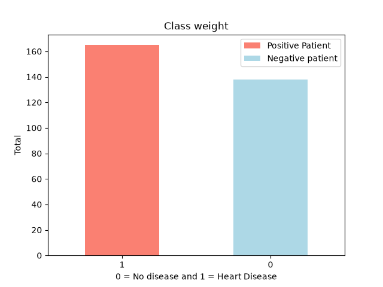)


#### 3.2 Heart Disease Gender based frequence
> **Purpose** Based on the below graph we can identify the ratio of the male and female of having the heart disease.
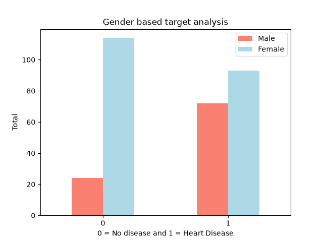

### 3.3 Age Distribution
> **Purpose** The purpose of the graph is to find how the data is distributed and to find out is it there any outlier's
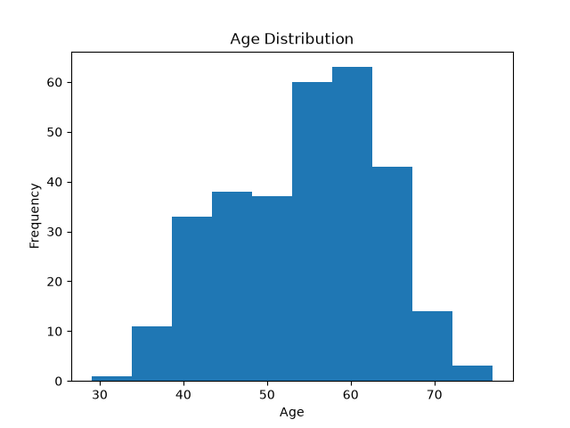

### 3.4 Maximum heart beat Rate V/S Age
> **Purpose** Based on the below graph we can observe the pattern at what parameter based on the age and Max Heart patient are postive heart disease patient.
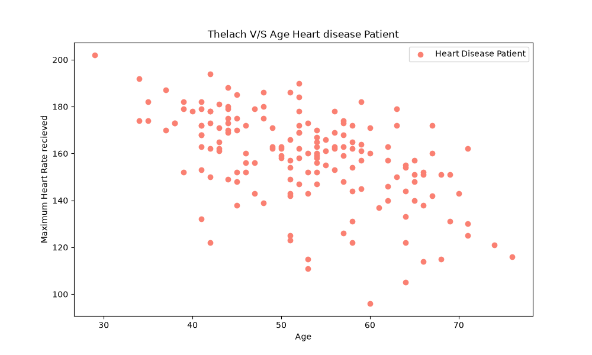

> **Purpose** Based on the below graph we can observe the pattern at what parameter based on the age and Max Heart patient are not heart disease patient.
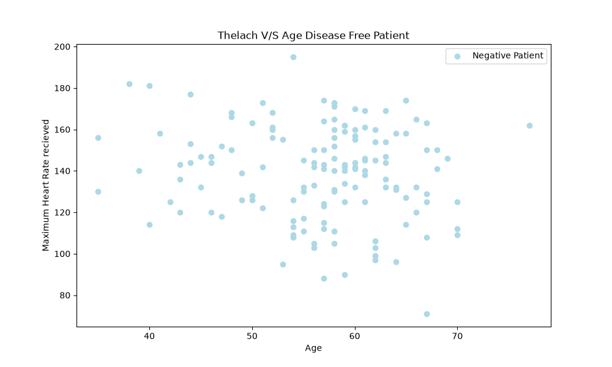


### 3.5 Chest Pain Type heart Disease Analysis
> **Purpose** The Purpose of the graph is to find which of the chest pain type have the most affected patient and which are the negative patient based on our current dataset.
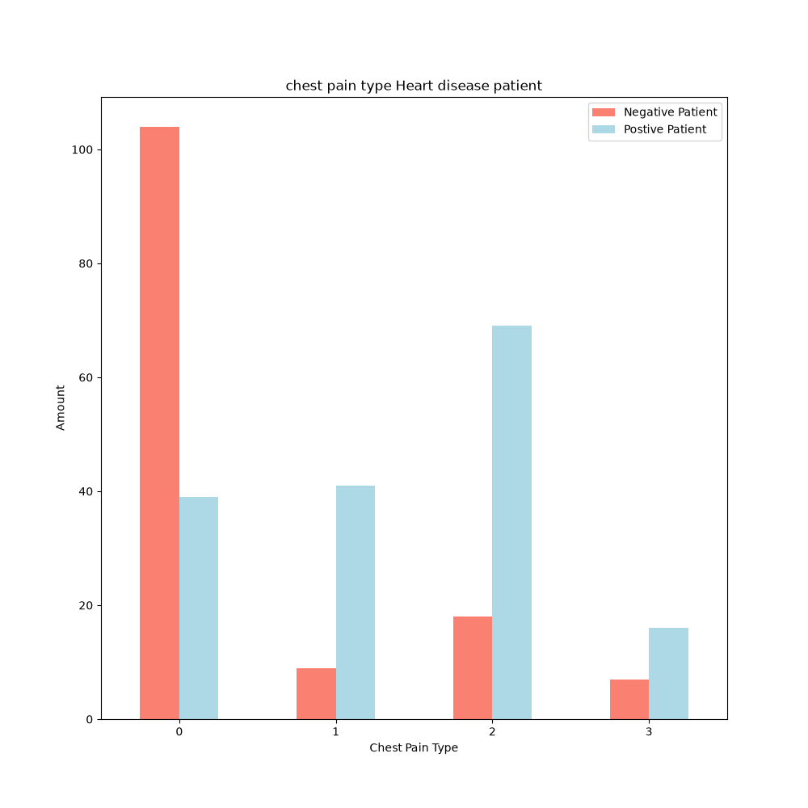


### 3.6 Correlation between the individual label and the target label
> **Purpose** The purpose of the correlation is to find the relation between the One feature vaiable with the target and other feature's present in the dataset.
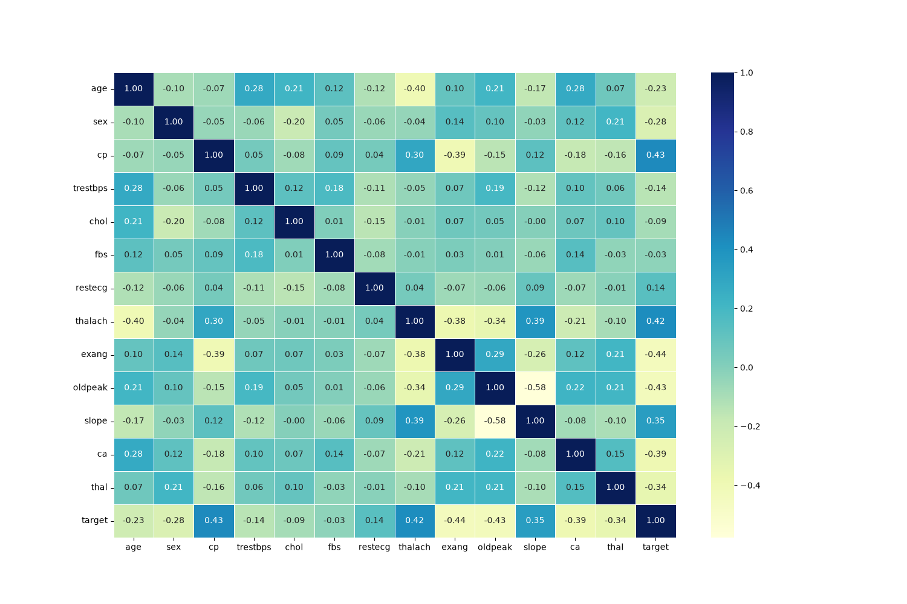

**Note for correlation**

`1 (Perfect Positive Correlation)`: As one variable increases, the other variable increases proportionally.

`0 (No Correlation)`: There is no linear or predictable relationship between the variables.

`-1 (Perfect Negative Correlation)`: As one variable increases, the other variable decreases proportionally

## 4. Modelling 

**What Modelling is** 

> Modelling means preapring our model to get deep dive into the model to build the model based on the [Provided Scikit learn estimator](https://scikit-learn.org/stable/machine_learning_map.html) to preare the best model.

### 4.1 KNeighborsClassifier

> After tunning the parameter's of the KNN (for parameter's negihbours), which ranges from 1 to 21 i found that it achived the `max accuracy score to the : 75.41%` which is not satisified see the below graph :
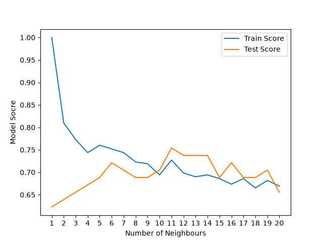

 
### 4.2 RandomForestClassifier 
> After tunning the parmaeter's for the RandomForest i got the score accracy `86.68%` then the baseline model of the RandomForeset which was `83.60%`

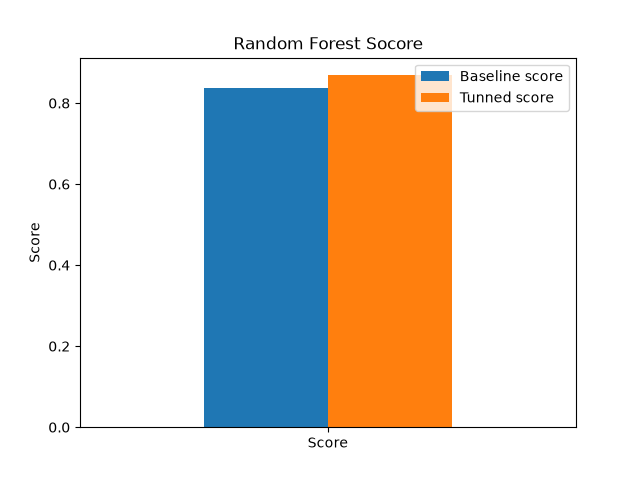

### 4.3 LogisticRegression
> After tunning the LogisticregRessor model the model reaced the `max accuracy 88.52%` which is max among all of them.

I choose the [Logistic Regression](https://scikit-learn.org/stable/modules/generated/sklearn.linear_model.LogisticRegression.html) estimator for the [Heart Disease Predictor](https://github.com/MohmmedFurqaan/ml-projects.git) based on the below graph as the [Logistic Regression](https://scikit-learn.org/stable/modules/generated/sklearn.linear_model.LogisticRegression.html) achieved the acuracy around 88% for the baseline model you can see it below : 
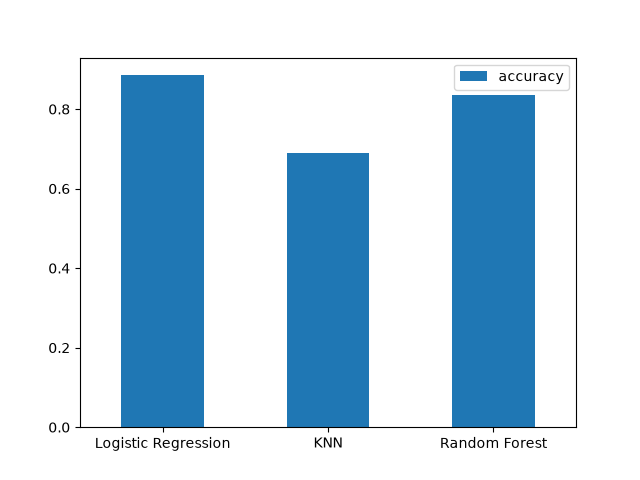

## 5. Evaluating the LogisticRegression Estimator

Evaluating the Machine learning model is important because we cannor depend on their score produce by the estimator. So for these we can do the following Metrics :
* [5.1 ROC and AUC Metrics](https://developers.google.com/machine-learning/crash-course/classification/roc-and-auc)
* [5.2 Confusion Metrics](https://scikit-learn.org/stable/modules/generated/sklearn.metrics.confusion_Metrics.html)
* [5.3 Classification Report](https://scikit-learn.org/stable/modules/generated/sklearn.metrics.classification_report.html)
* [5.4 Precession, Recall and F1 Score](https://medium.com/@piyushkashyap045/understanding-precision-recall-and-f1-score-metrics-ea219b908093)

### 5.1 ROC and AUC Metrics
> The ROC curve was plotted to evaluate the classification performance of the Logistic Regression model across different decision thresholds. The model achieved an AUC of 0.93, indicating strong discriminative ability between the positive and negative classes. The curve demonstrates that a relatively high TPR can be achieved while maintaining a comparatively low FPR. The appropriate classification threshold should be selected based on the application's requirements and the trade-off between false positives and false negatives.
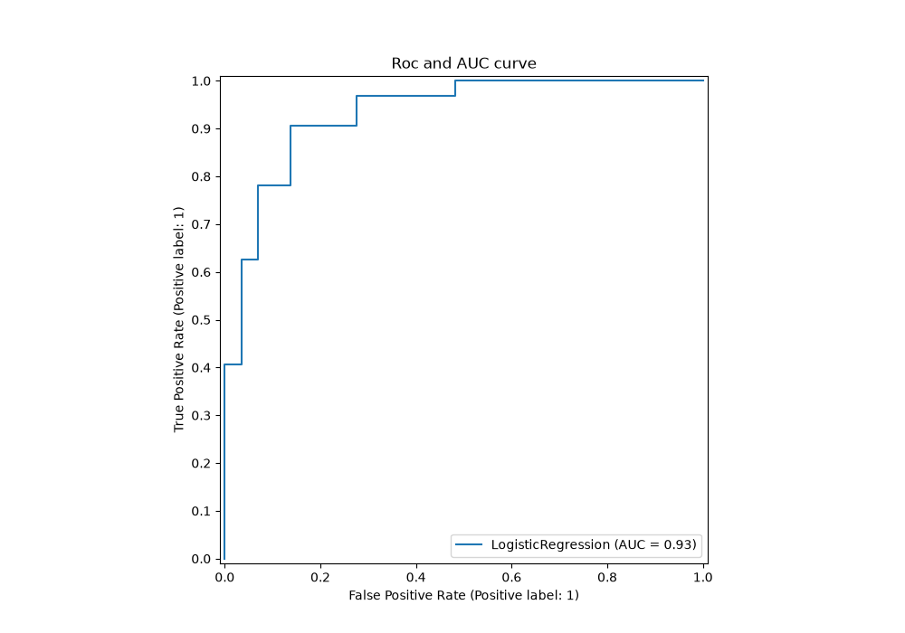

### 5.2 Confusion Metrics 
> The Confusion Metrics is evaluated to determine where our `LogisticRegression` is getting confused at the 0.5 thresholds. The model achived the **TPR 90.63%** while the **FPR is 13.79%** at the *thresholds 0.5*. In simple terms, the model correctly identifies approximately 91% of people who actually have heart disease, while incorrectly classifying approximately 14% of people without heart disease.
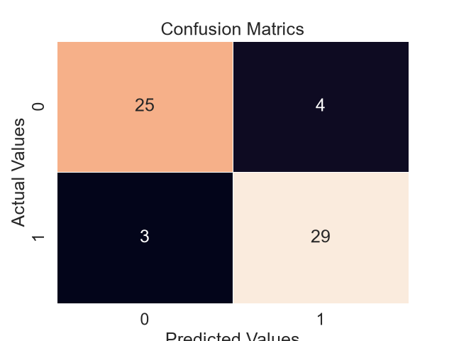

### 5.3 Classfication Report 
> The Below classifictio report is created from the Testing data set.

|           | 0     | 1     | accuracy   | macro avg   | weighted avg   |
|:----------|:------|:------|:-----------|:------------|:---------------|
| precision | 89.3% | 87.9% | 88.5%      | 88.6%       | 88.5%          |
| recall    | 86.2% | 90.6% | 88.5%      | 88.4%       | 88.5%          |
| f1-score  | 87.7% | 89.2% | 88.5%      | 88.5%       | 88.5%          |
| support   | 29    | 32    | 88.5%      | 61          | 61             |


## Important Disclaimer

This project is developed **for educational and machine learning practice purposes only**. It is **not a medical diagnostic tool** and should not be used to make real-world medical decisions. The model has not been clinically validated and should not replace professional medical advice.
