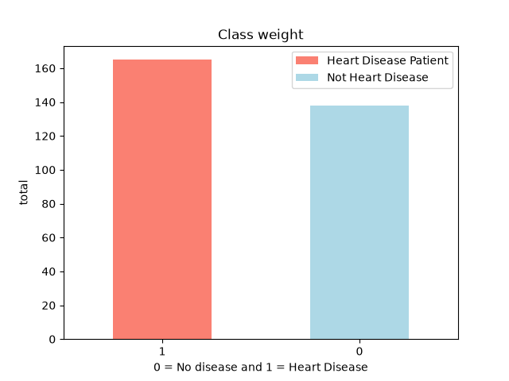
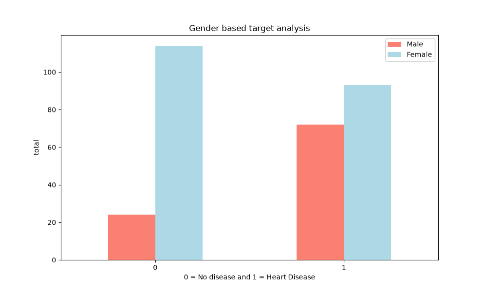

# Heart Disease Prediction

## Table of content

1. [Installation Guide](#Installation)
2. [About The Project](#About)
3. [Data Insights](#Data-Insights)
   * [1.1 Heart disease total cases](#1.1-Heart-disease-total-cases)
   * [1.2 Heart Disease Gender based frequence](#1.2-Heart-Disease-Gender-based-frequence)

## Installation

1. clone the repository in your local directory of your machine 

```code
git clone https://github.com/MohmmedFurqaan/ml-projects.git
```

2. Let's setup the envinoment

In the project root directory, You will find the `envirnoment.yml` file. These file contains the envirnoment dependencies you can setup the envirnoment by the following :

```code 
conda env create -f environment.yml
```

Then 

```code
conda activate my_ml_env
```

## About 

This project is a **machine learning practice project** focused on building an end-to-end classification workflow for predicting the presence of heart disease from patient-related features.

The project is built primarily to strengthen my understanding and practical implementation of the **complete machine learning workflow**, including data preprocessing, exploratory data analysis, model training, evaluation, and hyperparameter tuning.

The dataset and problem are based on an existing heart disease prediction task. **I did not create the underlying medical dataset or invent the problem; this project is my own implementation and practice exercise using an existing dataset.**

## Data Insights

Exploratory Data Analysis is the important part of the machine learning. As just training and evaluating the Machine learning is not just a way to get the best Model. 

The ML Engineer must also have the knowledge about the data below are some of the insights i caught from the data to find the pattern's bettween the data

#### 1.1 Heart disease total cases 
> **Purpose** : based on the below graph we can identify the class imbalancing in the data set that we have.




#### 1.2 Heart Disease Gender based frequence
> **Purpose** : Based on the below graph we can identify the ratio of the male and female of having the heart disease.



## Important Disclaimer

This project is developed **for educational and machine learning practice purposes only**. It is **not a medical diagnostic tool** and should not be used to make real-world medical decisions. The model has not been clinically validated and should not replace professional medical advice.
